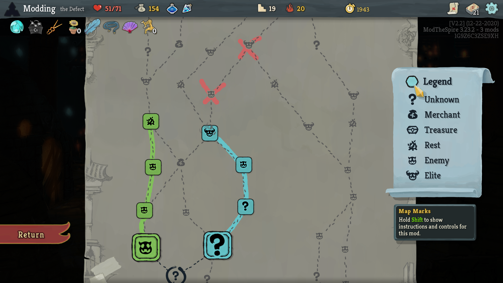
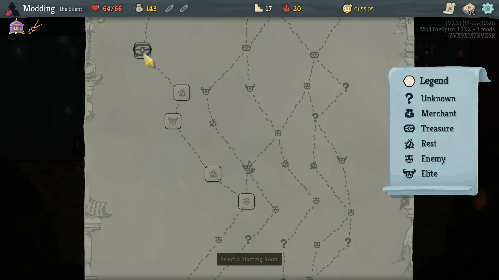
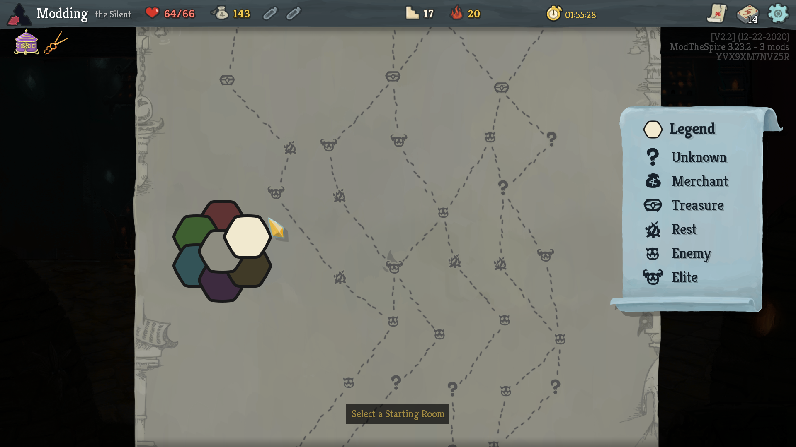
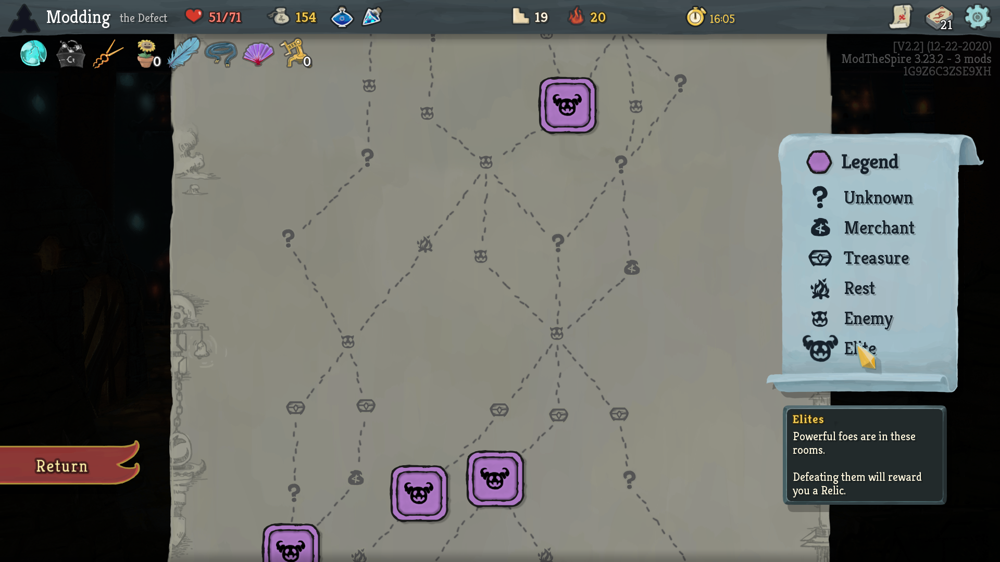
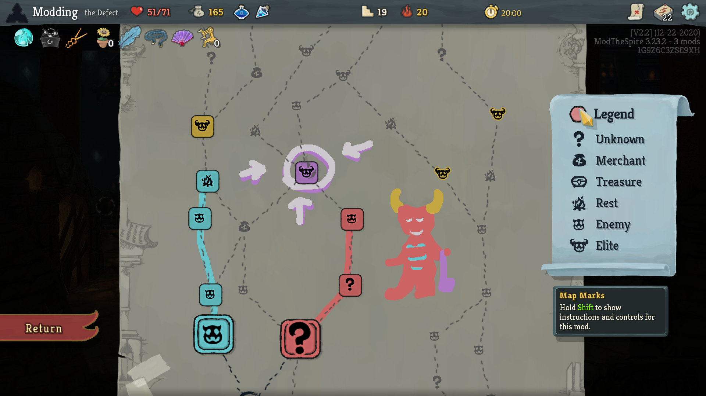

# Map Marks

Map Marks is a WIP Slay the Spire mod for map node highlighting. It is a spiritual successor and an attempt to improve upon two previous mods: "Highlight Paths" (by reina - [Steam workshop link](https://steamcommunity.com/sharedfiles/filedetails/?id=1611047977)) and "Better Paths" (the world's worst titled mod by me - [Github link](https://github.com/casey-c/sts_betterpaths)).

## Features

There are a number of improvements over the pre-existing highlighting mods:

### Highlights

Starting a

    right-click + hold + mouse move 

on top of a node will enter highlighting mode. While retaining right click, you can move your mouse around on top of other nodes to activate their highlights. You can also **single right-click** a node to toggle just that one node.

If you start a **right-click + drag** on an unhighlighted node, you will highlight all nodes you pass over with the mouse, setting their color to the currently selected one. If you start dragging on an already highlighted node, one of two things will happen: a repaint, if the color of the highlighted node is *different* than the currently selected color (this will just change the color of the node underneath but leave it highlighted, and will continue to act as if you're in highlighting mode for other nodes you pass over); or an unhighlight, if the node you start on already has the same color as the selected one.

E.g. if your current color is red and you start **right-click + drag** on a red node, you'll clear the highlight on the node you started on, and any node you pass over afterwards will also be cleared. If instead the starting node was *green*, you'll repaint that node to red and anything you pass over while still right click dragging will be set to red. It's much more intuitive than it sounds from this poorly written description.

### Quick Clear-All

You can 

    right-click

the color indicator to the left of the "Legend" text to remove all current highlighting. Holding SHIFT while mousing over this box also includes some in-game help on how to use the mod.

### Multicolor Highlighting
Use a radial selection menu to choose the current color. This menu can be used by 

    right-click + hold + mouse move

anywhere on the screen outside a node or the legend items. Pulling your mouse towards a color while the right-click is held will activate that color. You'll know if you've gone far enough along a particular direction when the other colors dim and the selected color is pulled to the top. Release right click to select that color. 

The current highlight color is displayed to the left of the "Legend" text on the right hand side of the screen (which can be right-clicked to clear all).

### Quick Category Toggle

Quickly enable / disable the highlights of all nodes of a certain type by **right-clicking** the corresponding legend item.

### Drawing

You can paint directly onto the map with 

    Alt+Right+Click+Drag

All paint can be cleared by Alt+Right+Clicking the legend button. 

Note that there isn't an undo button because there are no mistakes: only happy accidents.

### Additional Features

* Quickly hide unreachable nodes. You can mouse over a node and:

    Control + Right + Click

the node to remove any highlights from nodes that cannot path through this target node. An example use of this feature is to Right+Click the Elite legend item to highlight all elites, and then Control+Right+Click the Super Elite to show ONLY the elites that you can receive with a path that collects the emerald key.

* Unreachable nodes are automatically hidden once you choose a path. So if you highlight something that becomes no longer reachable once you move in a certain direction, it will no longer clutter your screen visually. You can mouse over the legend button to temporarily show these unreachable, but still highlighted nodes.

### Known issues

* Probably not compatible with the Colored Map or Dark Map mods, now that I have a patch to change the colored borders for my tiles to look okay. These will hopefully be fixed eventually, but for now please let me know how usable/unusable they actually are because I haven't done any testing yet!

* The tiles are a bit out of position for unusual resolutions (e.g. super square or super wide). It's still usable, but I sorta gave up trying to make the scaling work correctly while keeping 1080p a primary focus. So it's a little ugly for those.

* Winged boots are not taken into account for the unreachable node computations (yet). Planning on fixing this before the first major release.

* The radial menu pops up when closing the [InfoMod2](https://github.com/casey-c/infomod2) events overlay screen. Eventually I will port InfoMod into my Easel library and have it be more seamless, but we're not there yet.

## Installation

This is a rough pre-alpha of the mod. Don't use yet unless you're willing to encounter bugs / crashes / a slightly more painful installation.

Head to the [releases page](https://github.com/casey-c/mapmarks/releases) and download **both** the "easel" JAR file and the "MapMarks" JAR file. Easel is my currently unreleased UI library project (which once it's more stable will make its way to a more formal Github repo and the workshop). Because Easel is not even ready for an alpha release, I'm including the most up to date build of it so far alongside the releases of this repository. 

When this mod requires an update, you will want to redownload **both** of these JAR files to make sure everything is working. Eventually these both will be on the workshop to make things easy, but we're not there yet as there's a lot of work to do first.

Put the downloaded JAR files into your *SlayTheSpire/mods* directory, and be sure to enable them both once you launch Slay the Spire with mods. 

**IMPORTANT:** if you have installed any other highlight paths mod (e.g. the one from the workshop, or my other paths mod), **please disable and uninstall** them before trying this mod. They're probably not compatible.
